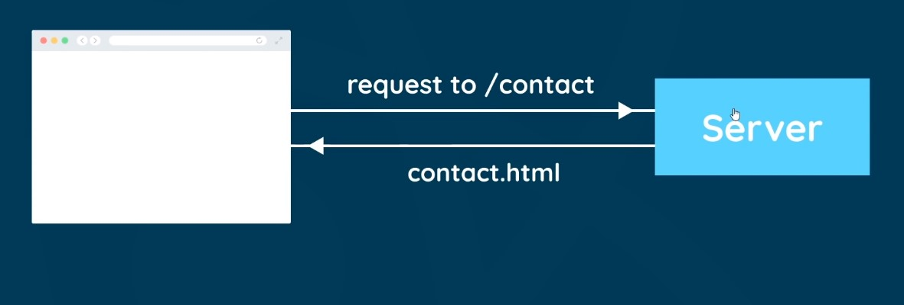
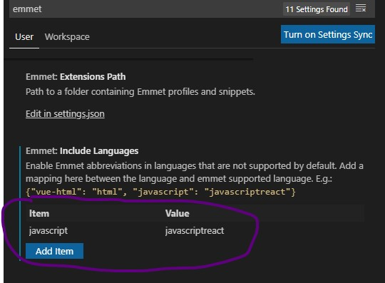
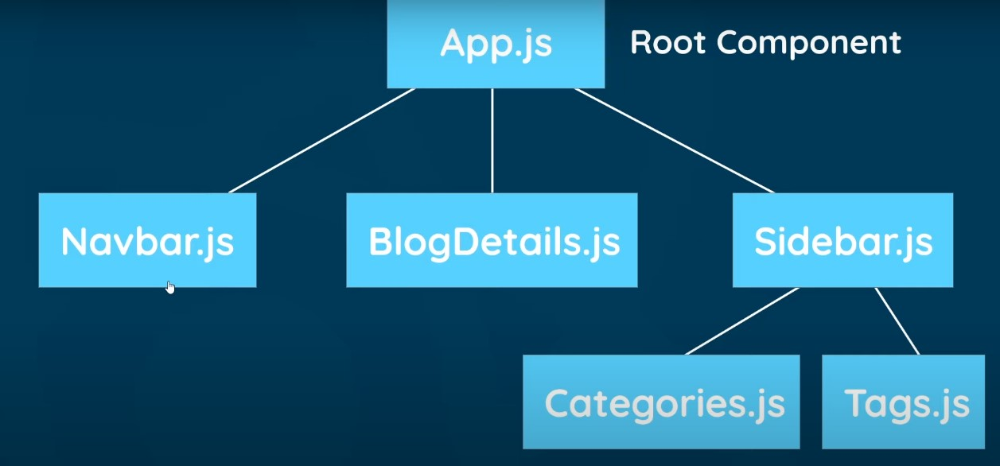
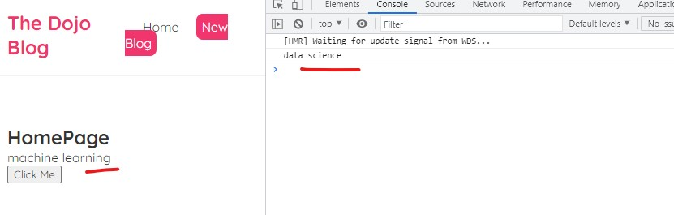
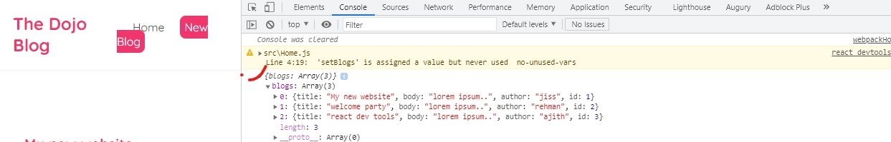
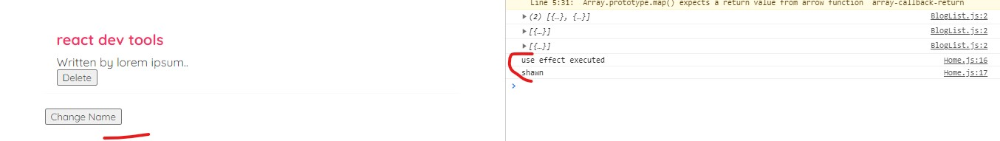

[What is React](#What-is-React)

[Extensions to Install](#Extensions-to-Install)

[Create a React Application](#Create-a-React-Application)

[File Structure Overview](#File-Structure-Overview)

[Components and Templates](#Components-and-Templates)

[Dynamic Values in Template](#Dynamic-Values-in-Template)

[Multiple Components](#Multiple-Components)

[Adding inline styles dynamically](#Adding-inline-styles-dynamically)

[Click Events](#Click-Events)

[Using State](#Using-State)

[Using useState React hook](#Using-useState-React-hook)

[Intro to React Dev Tools](#Intro-to-React-Dev-Tools)

[Outputting List](#Outputting-List)

[Props](#Props)

[Reusing Components](#Reusing-Components)

[Functions As Props](#Functions-As-Props)

[useEffect Hook Basics](#useEffect-Hook-Basics)

[useEffect Hook Dependencies](#useEffect-Hook-Dependencies)

[Using JSON Server](#Using-JSON-Server)

[Fetching Data with useEffect](#Fetching-Data-with-useEffect)

[Conditional Loading Message](#Conditional-Loading-Message)

[Handling Fetch Errors](#Handling-Fetch-Errors)

[Create Custom Hook](#Create-Custom-Hook)

# What is React


- **Single Page Application** means server only needs to send a single html page to the browser for the website to run fully.
- Then React takes over and manages the whole website in the browser including user events, website data,
  also routing from page -> page.
- When user clicks a nav in the website, request not sending to server instead React changes all the content in the website dependent on the route of the link user clicked.
- For example when user clicks on Contact nav, **React** look in to its route and then inject contact form on to the page.
- This in contract with traditional website where every links user clicks sends a request to the server and loads an html page. Check below image



# Extensions to Install

1. Simple React Snippets
2. Reactjs code snippets

To use emmet inside react components, update settings like below,



---

# Create a React Application

- Install Nodejs
- Go thru below link

  [Creating an App](https://github.com/facebook/create-react-app)

or run below command

```terminal
npx create-react-app my-app
cd my-app
npm run start
```

Check React Version

```terminal
npm view react version
```

# File Structure Overview

**node_module**: where all our project dependencies resides. if _node_modules_ not present in the project that downloaded from github. v can add it by running,

```terminal
npm install
```

**public > index.html** - Initial index file served by the server. React injects the components dynamically to the div element in this file.

```html
<div id="root"></div>
```

**src > App.js** - is the App component file. v export our App component here

**src > index.js** - where v render our App component to the DOM. V import the App component here.

```js
ReactDOM.render(
  <React.StrictMode>
    <App />
  </React.StrictMode>,
  document.getElementById('root')
);
```

- index.js takes the _App_ component and renders to the DOM inside the div element with id _root_

**package.json** - List all the dependecies of the app. Also have scripts to run & build the app.

---

# Components and Templates

## App Component

**App.js**

```js
function App() {
  return (
    <div className='App'>
      <header className='App-header'>
        
        <p>
          Edit <code>src/App.js</code> and save to reload.
        </p>
        <a
          className='App-link'
          href='https://reactjs.org'
          target='_blank'
          rel='noopener noreferrer'
        >
          Learn React
        </a>
      </header>
    </div>
  );
}
```

- here code inside the return() is _JSX_ template. and not _HTML_ template.

- JSX allows to create html style templates, and in background _Babel_ transpiles this jsx templates to html. and renders that html template to DOM.

- In JSX v use _className_ in place of _class_. while transpiling to html, it got converted to _class_.

# Dynamic Values in Template

**App.js**

- Using curly braces to add dynamic values to the template.

```js
function App() {
  const title = 'Welcome to our blog';
  const likes = 50;
  const link = 'https://www.google.com';
  return (
    <div className='App'>
      <div className='content'>
        <h1>{title}</h1>
        <p>Liked {likes} times</p>
        <a href={link}>Google Site</a>
      </div>
    </div>
  );
}
```

---

# Multiple Components



Root component is App.js, other components are nested inside the App component

Create a Navbar component in src

**Navbar.js**

_Stateless Function Component_

```js
const Navbar = () => {
  return (
    <nav className='navbar'>
      <h1>The Dojo Blog</h1>
      <div className='links'>
        <a href='/'>Home</a>
        <a href='/create'>New Blog</a>
      </div>
    </nav>
  );
};

export default Navbar;
```

Next import this component in _App.js_

**App.js**

```js
import Navbar from './Navbar';

function App() {
  return (
    <div className='App'>
      <Navbar />
      <div className='content'>
        <h1>App Component</h1>
      </div>
    </div>
  );
}
```

Create a **Home** component and Export

**Home.js**

```js
const Home = () => {
  return (
    <div className='home'>
      <h2>HomePage</h2>
    </div>
  );
};

export default Home;
```

Inject Home component in App component

**App.js**

```js
import Home from './Home';
function App() {
  return (
    <div className='App'>
      <Navbar />
      <div className='content'>
        <Home />
      </div>
    </div>
  );
}
```

# Adding CSS to the components

> delete _App.css_ file and it's import

**App.css**

```css
@import url('https://fonts.googleapis.com/css2?family=Quicksand:wght@300;400;500;600;700&display=swap');

/* base styles */
* {
  margin: 0;
  font-family: 'Quicksand';
  color: #333;
}
.navbar {
  padding: 20px;
  display: flex;
  align-items: center;
  max-width: 600px;
  margin: 0 auto;
  border-bottom: 1px solid #f2f2f2;
}
.navbar h1 {
  color: #f1356d;
}
.navbar .links {
  margin-left: auto;
}
.navbar a {
  margin-left: 16px;
  text-decoration: none;
  padding: 6px;
}
.navbar a:hover {
  color: #f1356d;
}
.content {
  max-width: 600px;
  margin: 40px auto;
  padding: 20px;
}
```

# Adding inline styles dynamically

```js
<a
  href='/create'
  style={{
    color: 'white',
    backgroundColor: '#f1356d',
    borderRadius: '8px',
  }}
>
  New Blog
</a>
```

# Click Events

Pass a function as a reference to onClick event. Check example below

While clicking on button, function is invoked

```js
const Home = () => {
  const handleClick = () => {
    console.log('hello ninjas');
  };
  return (
    <div className='home'>
      <h2>HomePage</h2>
      <button onClick={handleClick}>Click Me</button>
    </div>
  );
};

export default Home;
```

### Passing arguments to the function

invoke the function with in another function. check bewlow

```js

    function handleClickAgain(name) {
        console.log(`name: ${name}`);
    }
    return (
        <div className="home">
            <h2>HomePage</h2>
            <button onClick={handleClick}>Click Me</button>
            <button onClick={() => handleClickAgain('jissmon')}>Click Me Again</button>
        </div>
     );
}
```

### Event Object

Objects that we get access automatically when an event triggers.

When a funciton invoked event object is passed

```js
const handleClick = (e) => {
  console.log('hello ninjas', e);
};
function handleClickAgain(name, e) {
  console.log(`name: ${name}`, e.target);
}
return (
  <div className='home'>
    <h2>HomePage</h2>
    <button onClick={handleClick}>Click Me</button>
    <button onClick={(e) => handleClickAgain('jissmon', e)}>
      Click Me Again
    </button>
  </div>
);
```


# Using State

Making a value reactive. i.e changing the values according to events aoccures.
For this purpose we use, _hooks_.
here the hook is _useState_
By using this hook we create reactive value.

```js
const Home = () => {
  let name = 'jissmon';
  const handleClick = () => {
    name = 'thala ajith';
    console.log(name);
  };
  return (
    <div className='home'>
      <h2>HomePage</h2>
      <p>{name}</p>
      <button onClick={handleClick}>Click Me</button>
    </div>
  );
};
```

here the value of name wont change to even v click the button.

# Using useState React hook

```js
import { useState } from 'react';
const Home = () => {
  const [state, setstate] = useState('data science');
  const handleClick = () => {
    setstate('machine learning');
    console.log(state);
  };
  return (
    <div className='home'>
      <h2>HomePage</h2>
      <p>{state}</p>
      <button onClick={handleClick}>Click Me</button>
    </div>
  );
};

export default Home;
```

**useState()** takes the initial state. store it using array destructuring.
where variable `state` takes the initial value while `setstate`
used to update the initial state later in the code.
which is updated while invking **handleClick()** function.
thus changing value in template. Sceenshot below

Note: `state` is where v store initial state, `setstate` is used to update the `state`.



## Intro to React Dev Tools

https://chrome.google.com/webstore/detail/react-developer-tools/fmkadmapgofadopljbjfkapdkoienihi?hl=en

## Outputting List

Dynamically show list in the template by maping thru each object in the same. Use _map_ method. map filters thru each element in the array and make chnages in the same.

```js
const Home = () => {
    const [blogs, setBlogs] = useState([
        {title: 'My new website', body: 'lorem ipsum..', author: 'jiss', id: 1},
        {title: 'welcome party', body: 'lorem ipsum..', author: 'rehman', id: 2},
        {title: 'react dev tools', body: 'lorem ipsum..', author: 'ajith', id: 3}
    ])
    return (
        <div className="home">
            {blogs.map((blog) => (
                <div className="blog-preview" key={}>

                </div>
            ))}
        </div>
     );

```

Map called on blogs where v get access to each values in the same. then using jsx template to display each one in the list.
when v o/p a list in jsx template. Root template must hav a _key_ property to keep track of each item when DOM outputs it.
So if data changes at any point of time, react will keep track of it. keys are unique for each item.

```js
<div className='home'>
  {blogs.map((blog) => (
    <div className='blog-preview' key={blog.id}>
      <h2>{blog.title}</h2>
      <p>Written by {blog.body}</p>
    </div>
  ))}
</div>
```

`blog.id` refers to **key** property here. which is unique for each. it can be any unique property not just id.

# Props

Not repeating the same logic in every component, we make it reusable
for the component using **props** feature
In case of blogs, we create an external component and specify logic of cycling
through each blog there. Later v reuse it in multiple component.

**BlogList.js**

```js
const blogList = () => {
  return (
    <div className='home'>
      {blogs.map((blog) => (
        <div className='blog-preview' key={blog.id}>
          <h2>{blog.title}</h2>
          <p>Written by {blog.body}</p>
        </div>
      ))}
    </div>
  );
};
```

**Home.js**

```js
const Home = () => {
  const [blogs, setBlogs] = useState([
    { title: 'My new website', body: 'lorem ipsum..', author: 'jiss', id: 1 },
    { title: 'welcome party', body: 'lorem ipsum..', author: 'rehman', id: 2 },
    { title: 'react dev tools', body: 'lorem ipsum..', author: 'ajith', id: 3 },
  ]);
  return <blogList />;
};
```

- Here shows error _blogs not defined_ since the same not defined in Home component.
- To do that v use _Props_. Using the same v pass _blogs_ data from **Home** component
  to **blogList** component given in the return statement.
- Thus making it reusable.

Using Props Check Below:

```js
return <BlogList blogs={blogs} />;
```

- Pass blogs data to a variable. clubing them makes a prop.
- Means `blogs={blogs}` is a **Prop**.
- BlogList component get this prop as argument.

**BlogList.js**

```js
const BlogList = (prop) => {
  const blogs = prop.blogs;
  console.log(prop, blogs);
  return (
    <div className='home'>
      {blogs.map((blog) => (
        <div className='blog-preview' key={blog.id}>
          <h2>{blog.title}</h2>
          <p>Written by {blog.body}</p>
        </div>
      ))}
    </div>
  );
};
```

- We access the prop property which has an object blogs which contains an array
  of blogs.
- Then iterate thru each blog.



## Destructuring prop in each manner

Here v destructure that prop object when getting the same as an argument itself.

```js
// from this
const BlogList = (prop) => {};
// to this
const BlogList = ({ blogs }) => {};
```

# Reusing Components

```js
return (
  <div className='home'>
    <BlogList blog={blogs} title='All Blogs' />
    <BlogList
      blogs={blogs.filter((blog) => blog.author === 'Ajith')}
      title="Ajith's Blog"
    />
  </div>
);
```

- First case of BlogList We get all the blogs.
- Second case, we filtered out blogs of author `Ajith`.
- Thus reusing the BlogList component again.

---

# Functions As Props

Suppose we want to delete a blog,

**BlogList.js**

```js
<div className='blog-preview' key={blog.id}>
  <h2>{blog.title}</h2>
  <p>Written by {blog.body}</p>
  <button onClick={handleDelete(blog.id)}>Delete</button>
</div>
```

- Call _handleDelete_ gets blog id as parameter.
- Create this in Home component since blog state is defined in Home. Check Below

```js
const [blogs, setBlogs] = useState([
  { title: 'My new website', body: 'lorem ipsum..', author: 'jiss', id: 1 },
  { title: 'welcome party', body: 'lorem ipsum..', author: 'rehman', id: 2 },
  { title: 'react dev tools', body: 'lorem ipsum..', author: 'ajith', id: 3 },
]);
```

- Use _setBlogs_ to update/delete the blogs.
- Thus We create the function here and interact with data directly.
- Later pass this funtion to BlogList component as _Prop_.

**Home.js**

```js
const handleDelete = (blogId) => {
  // store blogs with unmatched id's to newBlogs variable
  const newBlogs = blogs.filter((blog) => blog.id !== blogId);
  // call setBlogs - Pass newBlogs
  setBlogs(newBlogs);
};
return <BlogList blogs={blogs} handleDelete={handleDelete} />;
```

- _BlogList_ component accept this prop as an argument.

**BlogList.js**

```js
const BlogList = ({ blogs, handleDelete }) => {};
```

This how we pass function as prop to another function.

---

# useEffect Hook Basics

- ueEffect hook runs every time when component renders.
- Also runs when state changes.
- It is useful for fetching the data.

```js
import { useEffect } from 'react';
useEffect(() => {
  console.log('use effect executed');
});
```

# useEffect Hook Dependencies

- when we want to run _useEffect_ function only after certain rendering instead of every renders.

- We use actual dependencies with useEffect.

- For example: If want to run useEffect only when a certain state is changed.

```js
// define a state
const [name, setName] = useState('mario');

// add a dependency array for state name in useEffect function.
useEffect(() => {
  console.log('use effect executed');
  console.log(name);
}, [name]);

// useEffect fires only whenever name changes
return (
  <div className='content'>
    <BlogList blogs={blogs} handleDelete={handleDelete} />
    <button
      onClick={() => {
        setName('shawn');
      }}
    >
      Change Name
    </button>
  </div>
);
// Once changed & then again button is clicked, useEffect doesn't runs since state is already changed in first click event.
```



---

# Using JSON Server

use json-server to fetch data

1. create a json file to store data.
2. Add **json-server** using npx to watch json file and wrap it with some
   endpoints/api's.
   ```bash
    npx json-server --watch data/db.json --port 8000
   ```
   **Note**: port number should be diff from our localhost port number
3. Once **json-server** installed & watched json file to wrap some api's.
4. some of those endpoints listed below
   

---

# Fetching Data with useEffect

> Fetch the data when component first renders

1. Set initial value of blogs to null.

```js
const [blogs, setBlogs] = useState(null);
```

2. `fetch` method is called inside `useEffect` which gives a Promise object.

3. Call `then` on `fetch` to return a response object.

4. Call json() on response object to get the data.

5. On returning the data we get a `Promise` object

6. Again apply `then` and pass a parameter to it to get the data.

```js
useEffect(() => {
  fetch('http://localhost:8000/blogs')
    .then((res) => {
      return res.json();
    })
    .then((data) => {
      console.log(data);
    });
}, []);
```

7. Update the blog state with new blogs data.
   pass data to `setBlogs` function

```js
useEffect(() => {
  fetch('http://localhost:8000/blogs')
    .then((res) => {
      return res.json();
    })
    .then((data) => {
      setBlogs(data);
    });
}, []);
```

8. Run the server which result in error like below

```bash
TypeError: Cannot read property 'map' of null
```

Because `blogs` get null value initially

```js
const [blogs, setBlogs] = useState(null);
```

To override that, use **conditional formatting on JSX template** like below

```jsx
return (
  <div className='content'>
    {blogs && <BlogList blogs={blogs} handleDelete={handleDelete} />}
  </div>
);
```

Here template renders only if both conditions were true.

**Summary**

1. Fetch the data
2. Update the state with data.
3. Updated state has a value now, then output the component and pass that value as props.
4. Later iterate on that value and renders it in the DOM.

# Conditional Loading Message

Shows a loading message in browser in mean time while content loads.

1. Define a state and assign true to the same.

```js
const [isPending, setIsPending] = useState(true);
```

2. Show it in the template using `conditional formatting`

```jsx
{
  isPending && <div>Loading...</div>;
}
```

3. Once content loads, remove the same.
   So, Call the `setIsPending()` passing a `false` as argument.

```js
 .then(data => {
                setBlogs(data);
                setIsPending(false);
            })
```

Thus how we conditionally o/p a message.

---

# Handling Fetch Errors

Letting users know an error happened while fetching data.

> **Network Connection Error**

To catch network errors, use catch method which logs the error message.

```js
fetch('http://localhost:8000/blogs')
  .then((res) => {
    return res.json();
  })
  .then((data) => {
    setBlogs(data);
    setIsPending(false);
  })
  .catch((err) => {
    {
      console.log(err.message);
    }
  });
```


> **What if api from which user tried to fetch data doesn't exit and server returns a response object user not expected?**

- How to catch such errors?

  1. use _res.ok_ property to check we got correct response back, if yes, returns true else returns false.
  2. if false is the value, throw an error with a message.
  3. `catch` block catches that error and logs the message.

```js
fetch('http://localhost:8000/blogssss')
  .then((res) => {
    console.log(res);
    if (!res.ok) {
      throw Error(`Couldn't fetch data`);
    }
    return res.json();
  })
  .then((data) => {
    setBlogs(data);
    setIsPending(false);
  })
  .catch((err) => {
    {
      console.log(err.message);
    }
  });
```


---

# Create Custom Hook

Aim: To reuse the hooks in multiple places.

1. Create new file and define a function which will be the _custom hook_.
   Note: Custom Hooks starts with name `use`, else not works.

2. Cut & paste `useEffect` and all `states` from Home component to new custom hook.

Check Below - new Custom Hook

**useFetch.js**

```js
import { useState, useEffect } from 'react';
const useFetch = () => {
  const [data, setData] = useState(null);
  const [isPending, setIsPending] = useState(true);
  const [error, setError] = useState(null);
  useEffect(() => {
    fetch('http://localhost:8000/blogs')
      .then((res) => {
        console.log(res);
        if (!res.ok) {
          throw Error(`Couldn't fetch data`);
        }
        return res.json();
      })
      .then((data) => {
        setData(data);
        setIsPending(false);
        setError(null);
      })
      .catch((err) => {
        {
          setIsPending(false);
          setError(err.message);
        }
      });
  }, []);
};

export default useFetch;
```

3. Return the states as object of arrays.

```js
    }, []);
    return {data, isPending, error};
}
```

4. Instead of hardcoding url to **fetch()**, we specify it with in both `hook` and `fetch` as parameter.

5. Place it as an array dependency to `useEffect`. So when `url` changes it re-renders the `useEffct` to get the data with respect to endpoints.

```js
const useFetch = (url) => {
  const [data, setData] = useState(null);
  const [isPending, setIsPending] = useState(true);
  const [error, setError] = useState(null);
  useEffect(() => {
    fetch(url)
      .then((res) => {
        console.log(res);
        if (!res.ok) {
          throw Error(`Couldn't fetch data`);
        }
        return res.json();
      })
      .then((data) => {
        setData(data);
        setIsPending(false);
        setError(null);
      })
      .catch((err) => {
        {
          setIsPending(false);
          setError(err.message);
        }
      });
  }, [url]);
  return { data, isPending, error };
};
```

6. Destructure the returned state using `object destructuring` and import `useFetch` of custom hook to `Home` component.

**Home.js**

```js
import useFetch from './useFetch';
const Home = () => {
  const {
    data: blogs,
    isPending,
    error,
  } = useFetch('http://localhost:8000/blogs');
  return (
    <div className='content'>
      {error && <div>{error}</div>}
      {isPending && <div>Loading...</div>}
      {blogs && <BlogList blogs={blogs} />}
    </div>
  );
};
```

Note: `{data: blogs}` means we call the `data` we get as `blogs`. That's it.

Thus we can reuse this hook in various components.

---
